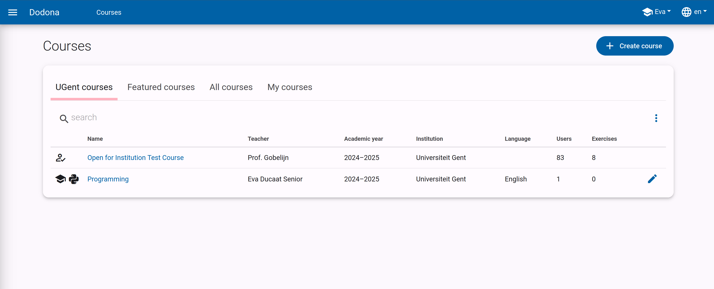
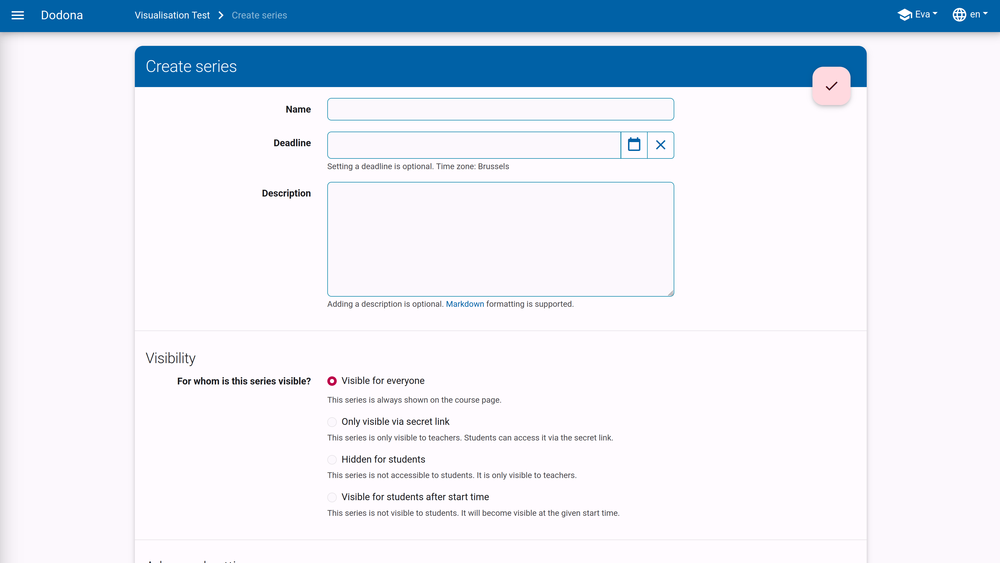
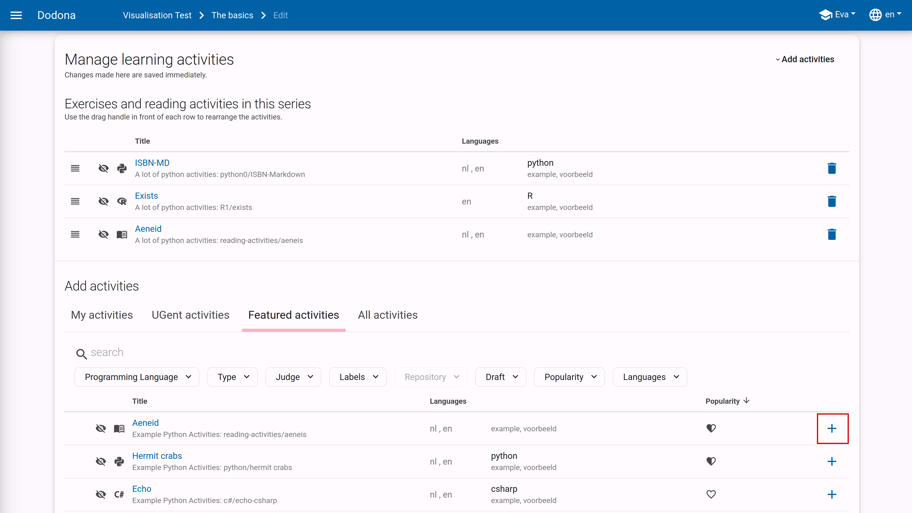
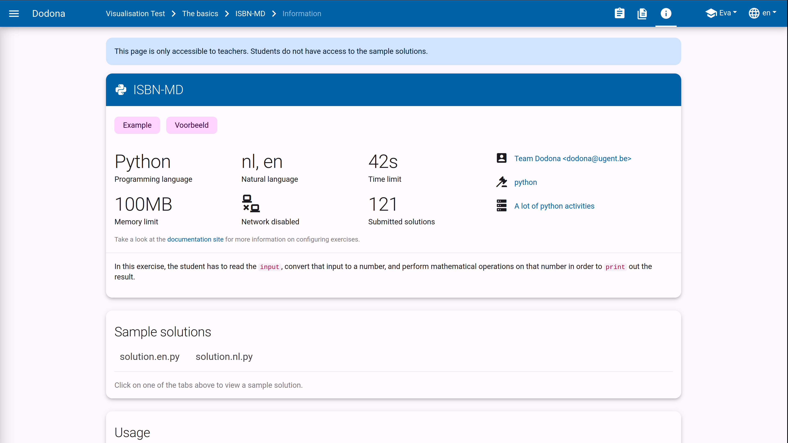
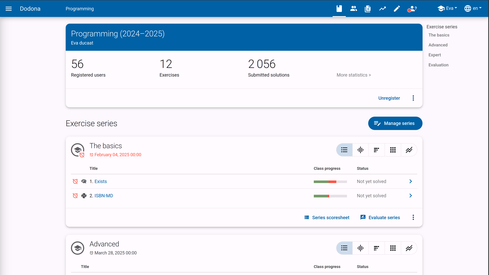

# Getting Started with Dodona as a Teacher

All the information to get started smoothly with Dodona as a teacher.

## What is Dodona?

Dodona is an online exercise platform for learning to code.
The web application was developed at Ghent University to support practical exercises for large groups of students.
Dodona therefore primarily focuses on the automatic testing and feedback of submitted solutions to programming exercises.
Currently, Dodona supports programming languages such as Python, JavaScript, Java, Kotlin, C#, bash, Prolog, Haskell, SQL, and R.

On Dodona, teachers can create their own course, built from different exercise series.
They can use existing courses and exercises or choose to create their own exercises and teaching materials.
Thanks to the built-in *learning analytics* and data visualizations, it is also easy to measure students' progress.

## Signing In

You can sign in to Dodona using your school's Microsoft 365, or Google Workspace account.
Dodona then receives your name, email address, and school name from the chosen login system.
Based on this information, we can identify you and automatically create a Dodona account the first time you log in.
Your password is never sent to us.

::: tip Multiple login systems?
Some schools offer login via both Smartschool and Microsoft 365 or Google Workspace.
Since your Dodona account is linked to the login system used, you will have two different Dodona accounts if you log in via Smartschool first and then via Microsoft 365.

To prevent issues, we can limit the login options for your school.
Contact us at <a href="mailto:dodona@ugent.be">dodona@ugent.be</a> for this.
:::

A standard Dodona account can freely enroll in courses and submit exercises without limitations.
If you want to create a course or set up exercises as a teacher, you will need additional rights.
Use the [request form](https://dodona.be/en/rights_requests/new) on Dodona, and we will grant you the necessary rights as soon as possible.

## Creating a Course

Once we have activated your teacher rights, you can create a course by clicking the `Create Course` button in the [course overview](https://dodona.be/en/courses/).

You can then choose to start from an empty course or to copy and modify the content of an existing course.
For inspiration, you can browse our [featured courses](https://dodona.be/en/courses/?tab=featured).

We give more details about creating a course in this [guide](/en/guides/teachers/creating-a-course).

## Setting Up a Course

A course on Dodona consists of different exercise series that you can use to group exercises.
To create a new exercise series, click the `Manage Series` button on your course page and then `Create Series`.
You will see the following form:

Each exercise series consists of a title and a description that you can use to refer to teaching materials, for example.
In addition to regular text, you can also use the [Markdown format](/en/references/exercise-description/#markdown) to add extra formatting.
You can also specify an optional deadline and set the visibility of the series.

After creating a series, you can add exercises and reading activities.
You can choose from all exercises and activities available to you in Dodona.
Using the search field, you can easily filter the list of exercises. 

When selecting exercises, you can view more information about an exercise by going to the info page.
Here you will find sample solutions, available languages, settings, additional explanations, and the author's contact details.

In our guide on [exercise series management](/en/guides/teachers/exercise-series-management), you will find more information on how to manage exercise series.

If you'd like to create your own exercises, we have a guide for that too.
In [this guide](/en/guides/exercises/creating-exercises), you will find all the information on how to create exercises for Dodona.

## Using Your Course

Once you have set up your course, you can use it in your class.
Students should easily find your course in the list once signed in, or you can share the course link with them.
You can easily follow along with your students' progress using our built-in analytics.

Dodona also allows you to provide feedback, grade exercises, and answer questions.
The following guides explain all the possibilities in detail:
- [Course management](/en/guides/teachers/course-management)
- [User management](/en/guides/teachers/user-management)
- [Grading tasks and tests](/en/guides/teachers/grading)
- [Answering questions](/en/faq/annotations)
