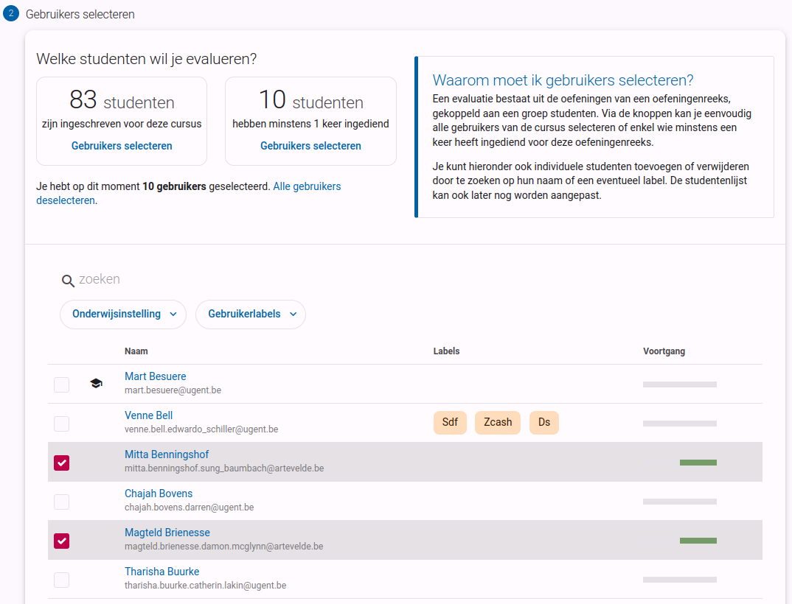
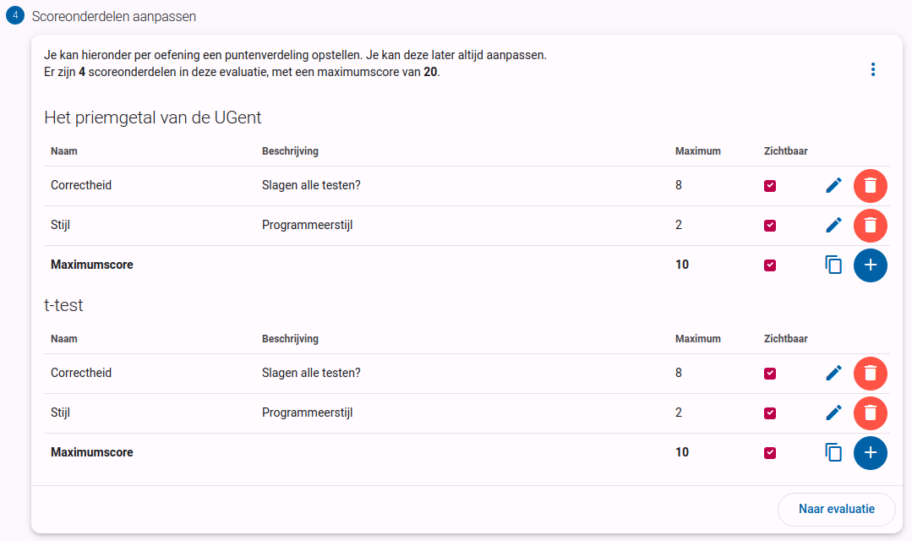
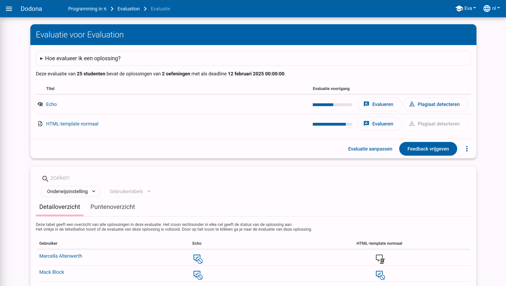
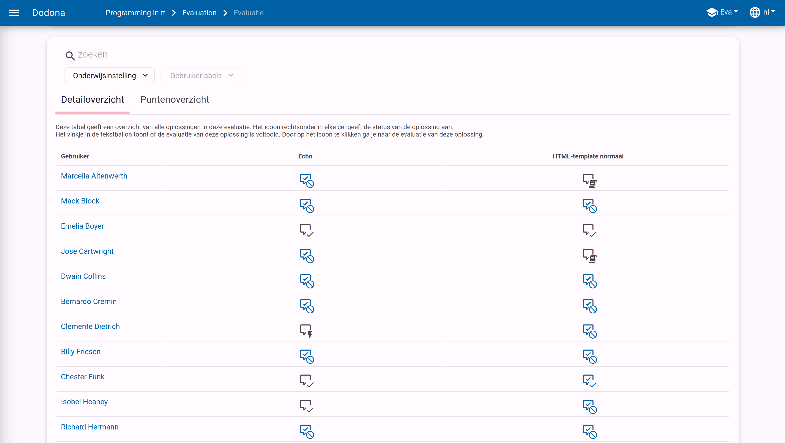
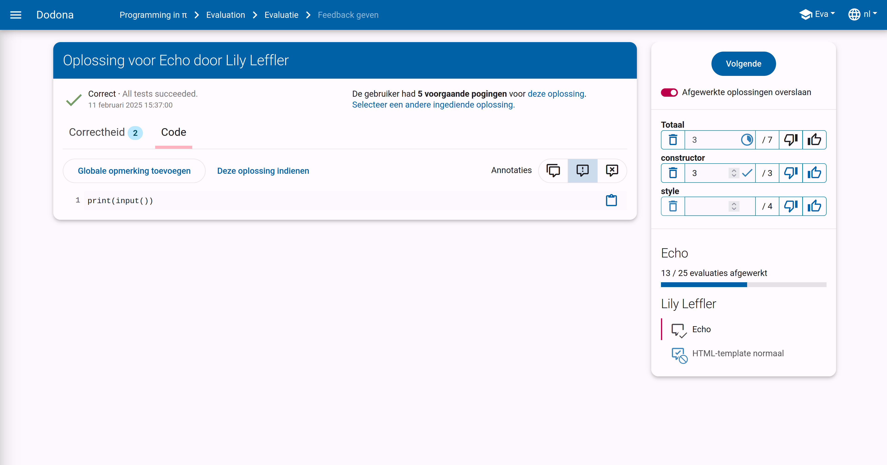

# Taken en toetsen verbeteren met Dodona

Sinds september 2021 heeft Dodona een verbetermodule. Ideaal om op een gestructureerde manier door de ingediende oplossingen te gaan en feedback en/of punten te geven.

## Een reeks evalueren

Het verbeteren van oefeningen gebeurt steeds per reeks. Als je een taak, toets of examen later wil verbeteren, dan maak je hier dus best een aparte reeks voor aan.

Rechts onderaan de reeks vind je een knop om een nieuwe evaluatie voor die reeks aan te maken. Eenmaal aangemaakt kan je via dezelfde weg de evaluatie terugvinden.

## Je evaluatie configureren

Voor je kan beginnen met verbeteren moet je eerst de evaluatie configureren. Je moet bijvoorbeeld selecteren welke studenten je wil opnemen en of je een puntenverdeling per oefening wil instellen. Bij het aanmaken wordt je door de verschillende stappen gegidst.

### Een deadline kiezen

Een eerste keuze die je moet maken is welke deadline je wil gebruiken. Voor elke student zal de laatst ingediende oplossing voor het gekozen tijdstip geselecteerd worden.

Als een reeks een deadline had ingesteld dan wordt deze automatisch overgenomen, maar je kan ze hier eventueel wel aanpassen.

Een deadline kan enkel in het verleden liggen en na het maken van je keuze kan ze niet meer worden aangepast.

### Studenten selecteren

In een tweede stap kies je welke studenten opgenomen moeten worden in de evaluatie. Je kan studenten individueel selecteren, of gebruik maken van de standaardconfiguraties: alle studenten die zich inschreven in de cursus, of alle studenten die minstens voor 1 van de oefeningen iets hebben ingediend.

Als je gebruik maakte van een van de standaardconfiguraties kan je nog steeds de studentenlijst manueel aanpassen.

De studentenlijst is eenvoudig filterbaar via het zoekvak bovenaan de lijst en geeft tevens een beknopt overzicht van wie welke oefeningen correct indiende.

### Punten geven?

In de volgende stap beslis je of je punten wil koppelen aan je evaluatie. Als je er voor kiest om geen punten te geven, dan kan je tijdens het evalueren op een gestructureerde manier door de ingediende oplossingen van de studenten stappen en manueel feedback aan hun oplossingen toevoegen.

### Een puntenverdeling opstellen

Als je er voor gekozen hebt om punten te geven, dan kan je in de laatste stap de puntenverdeling configureren. Je kan per oefening een of meerdere scoreonderdelen toevoegen. Op basis van de verschillende deelpunten wordt automatisch een totaal per oefening en voor de volledige evaluatie berekend.

Via het menu rechtsboven kan je scoreonderdelen aan alle oefeningen tegelijk toevoegen.

Als je een scoreonderdeel toevoegt, dan kan je volgende dingen instellen:
* **naam**: de naam van het scoreonderdeel, typisch 1 woord
* **beschrijving** (optioneel): een korte beschrijving van het scoreonderdeel
* **maximumscore**: hoeveel punten je aan dit onderdeel wil toekennen, tot op een kwart punt nauwkeurig
* **zichtbaarheid**: nadat je de evaluatie hebt afgerond kan je alle feedback en punten vrijgeven aan de studenten. Je hebt hierbij de keuze om bepaalde deelpunten voor hen te verbergen.

## Het evaluatieoverzicht

Nu je de evaluatie geconfigureerd hebt, kom je op de overzichtspagina van de evaluatie terecht. Deze pagina bestaat uit verschillende onderdelen.

### Evaluatievoortgang

Bovenaan vind je een overzicht van de huidige toestand van de evaluatie.
Voor elke oefening geeft een balk het percentage oplossingen aan dat al is beoordeeld.
Klik op de `Evalueren`-knop om de volgende niet-beoordeelde oplossing voor die oefening te beoordelen.

Studenten die geen oplossing hebben ingediend voor een bepaalde oefening, worden automatisch als voltooid gemarkeerd.
Daarom kan het voorkomen dat de voortgangsbalken al gedeeltelijk gekleurd zijn na het aanmaken van de evaluatie.

::: tip
Voordat je begint met beoordelen, wil je misschien controleren op plagiaat.
Door op `Plagiaat detecteren` te klikken, opent een nieuw tabblad met ons plagiaatdetectietool [dolos](https://dolos.ugent.be/).
Hier kun je gemakkelijk zien of studenten verdacht vergelijkbare oplossingen hebben ingediend voor een bepaalde oefening.
:::

### Detailoverzicht

Onder de samenvatting vind je het gedetailleerde overzicht.
Deze tabel bevat een icoon voor elke student voor elke oefening.

Een blauw icoon met een vinkje betekent dat de overeenkomstige oplossing al is beoordeeld.
Een grijs tekstballonnetje geeft aan dat hier feedback of cijfers moeten worden ingevuld.

In de onderste rechterhoek van elk icoon vind je het statusicoon van de laatste ingediende oplossing van de student voor die oefening.
Als de student geen oplossing heeft ingediend, zie je een cirkel met een streepje.

Door over de iconen te hoveren, wordt hun betekenis uitgelegd. Elk van de iconen is klikbaar en brengt je naar de overeenkomstige oplossing van die student voor die oefening.

### Puntenoverzicht

Als je er voor gekozen hebt om punten te geven, dan is het puntenoverzicht ook zichtbaar. Analoog aan het detailoverzicht is in deze tabel ook een vakje per student per oefening voorzien. In elke vakje wordt de score weergegeven die je aan de corresponderende oplossing gaf. Indien nog geen punten voor een oplossing werden ingegeven, dan krijg je een streepje te zien. Indien nog niet voor alle scoreonderdelen een punt werd ingegeven, dan wordt de score in het lichtgrijs afgebeeld. Ook hier is elke score aanklikbaar en kom je zo bij de corresponderende oplossing terecht.

De totaalscore per student en het gemiddelde voor elke oefening worden automatisch berekend.

In de rechterbovenhoek van het puntenoverzicht is een downloadknop zichtbaar. Als je hier op klikt, dan wordt een csv-bestand met de punten gedownload. Dit bestand kan je eenvoudig open in bijvoorbeeld Excel.

## Een oplossing evalueren

Op de evaluatiepagina krijg je steeds de laatst ingediende oplossing voor de deadline van een student voor een bepaalde oefening te zien.

Aan de linkerkant zie je de status van de tests en de ingediende code.
Feedback kan worden toegevoegd aan een specifieke regel code door op het regelnummer te klikken.
Voor algemene feedback klik je op `Globale opmerking toevoegen`.
Meer informatie over het toevoegen en hergebruiken van opmerkingen vind je in [deze FAQ](/nl/faq/annotations#hoe-kan-ik-opmerkingen-geven-op-een-oplossing-van-een-student).

**Merk op**: De feedback die je hier geeft, is niet automatisch zichtbaar voor de studenten.
Feedback binnen een evaluatie moet altijd worden vrijgegeven via de `Feedback vrijgeven`-knop op het evaluatieoverzicht.

Aan de rechterkant van de pagina vind je de navigatie en score-interface. Van boven naar onder zie je volgende elementen:
* **Volgende**: via deze knop ga je snel naar de volgende student voor dezelfde oefening.
* **Punten geven**: Hier zie je alle score-items voor deze oefening. Je kan een score geven voor elk van de onderdelen. Je punten worden automatische bijgehouden als je ze intikt en ook de totaalscore is zo steeds up-to-date. Als alle deelscores zijn ingegeven, dan verschijnt een vinkje onder **Totaal**: Via het duimpje omhoog en omlaag kan je snel een 0 of de maximumscore op een onderdeel invullen.
* **Voortgang voor deze oefening**: Dit is dezelfde voortgangsindicator als op de overzichtspagina. Het balkje geeft weer hoe ver je staat in het verbeterproces voor deze oefening.
* **Status van de student**: Hier zie je de status van de ingediende oplossingen voor alle oefeningen binnen deze reeks. Deze icoontjes zijn klikbaar en brengen je snel naar de corresponderende evaluatiepagina.

::: tip Gebruik de anonieme modus voor anoniem verbeteren

Om zo objectief mogelijk te verbeteren is het soms beter om de naam van de student in kwestie niet te zien. Op Dodona kan je hiervoor de anonieme modus inschakelen door rechtsboven op de pagina op je naam te klikken. Hierdoor worden de namen van de studenten geanonimiseerd.

:::
